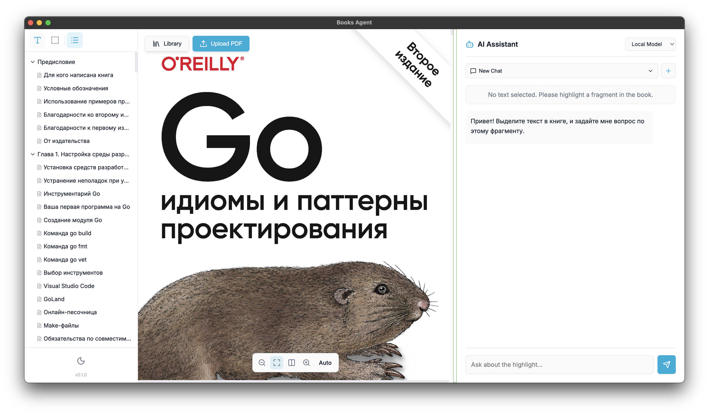

# Books Agent




Desktop-приложение для чтения технических PDF-книг с интегрированным ИИ-ассистентом. 


## Запуск

```bash
npm install
npm run dev            # Vite (браузер)
npm run dev:electron   # Electron в dev-режиме
npm run build:mac      # Сборка DMG
```

## Структура

```
├── electron/          # Main process
├── public/            # pdf.worker
├── assets/            # Иконка приложения
├── src/
│   ├── ai/            # ИИ-агент (заглушка + README)
│   ├── components/    # React-компоненты
│   ├── App.jsx
│   ├── index.css      # Стили + дизайн-токены
│   └── main.jsx
├── books/             # PDF-файлы (не в git)
└── package.json
```
<p>
  
</p>
<pre hspace="12">
   Telegram ······ <a href="https://t.me/Jas953/">t.me/Jas953</a>
   LinkedIn ······ <a href="https://www.linkedin.com/in/jas952/">linkedin.com/in/jas952</a>
   X        ······ <a href="https://x.com/not__jas">x.com/not__jas</a>
</pre>
<br clear="left" />
